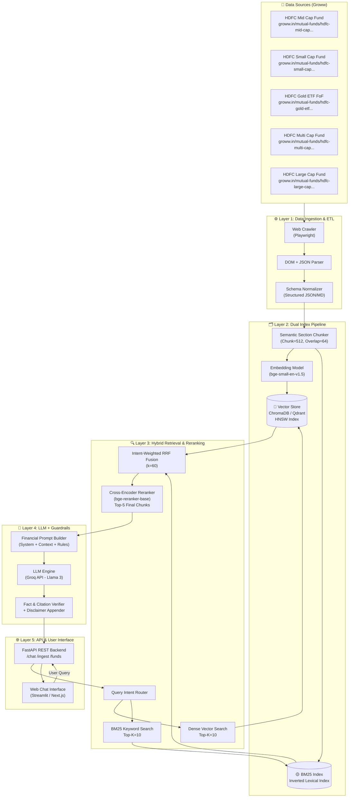
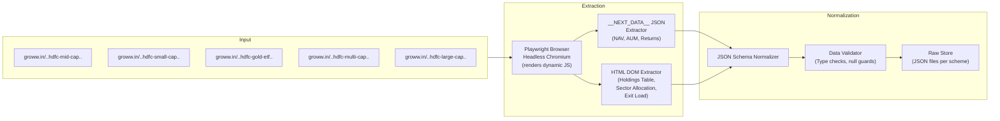
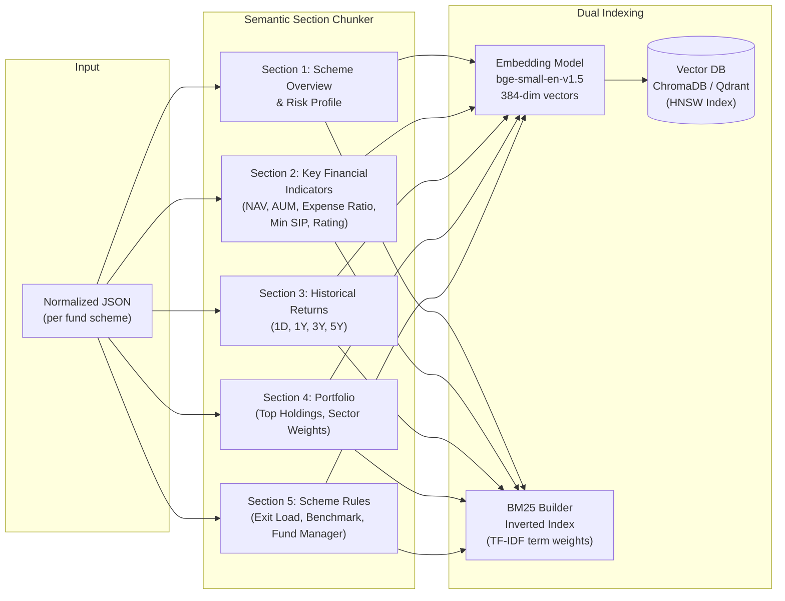
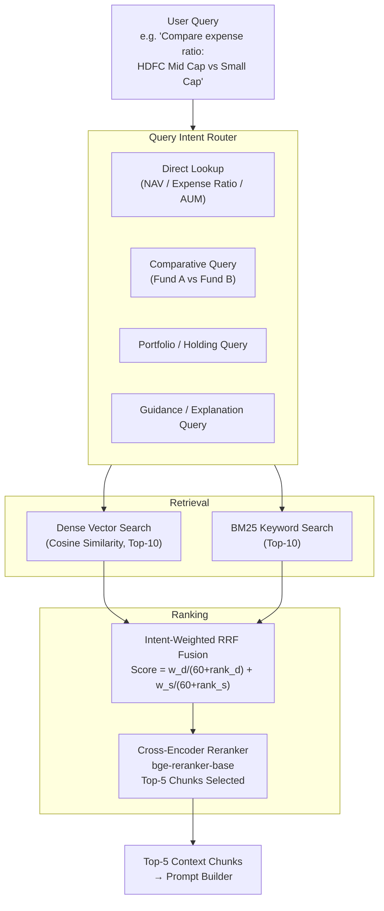
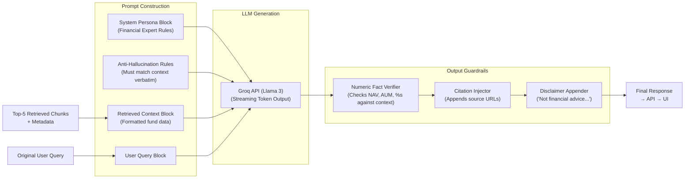
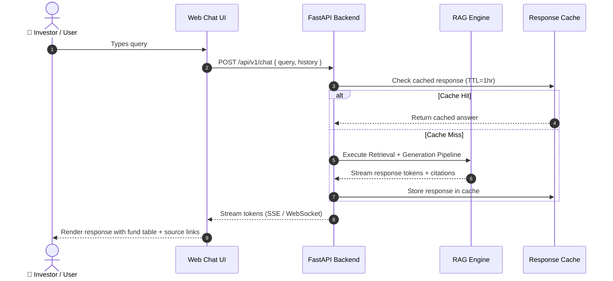
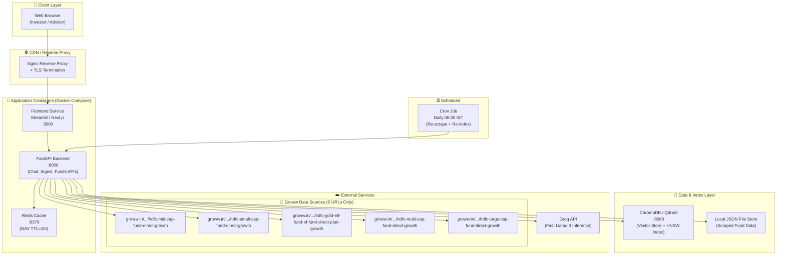

# System Architecture: Financial RAG Chatbot for HDFC Mutual Funds

## 1. Executive System Overview

The **HDFC Mutual Funds RAG Chatbot** is a production-grade Retrieval-Augmented Generation (RAG) system engineered to deliver accurate, context-grounded, and hallucination-free answers to user queries about five specific HDFC mutual fund schemes hosted on Groww.

**Knowledge Corpus:** Strictly limited to 5 specific Groww mutual fund web pages for HDFC schemes (Mid-Cap, Small-Cap, Multi-Cap, Large-Cap, Gold FoF). **No PDFs, CSV files, APIs, databases, or any other external document sources are used.**

**External Data Sources — Exclusively the following 5 Groww URLs:**

| # | Fund Scheme | Groww URL |
| :--- | :--- | :--- |
| 1 | HDFC Mid Cap Fund Direct Growth | `https://groww.in/mutual-funds/hdfc-mid-cap-fund-direct-growth` |
| 2 | HDFC Small Cap Fund Direct Growth | `https://groww.in/mutual-funds/hdfc-small-cap-fund-direct-growth` |
| 3 | HDFC Gold ETF Fund of Fund Direct Plan Growth | `https://groww.in/mutual-funds/hdfc-gold-etf-fund-of-fund-direct-plan-growth` |
| 4 | HDFC Multi Cap Fund Direct Growth | `https://groww.in/mutual-funds/hdfc-multi-cap-fund-direct-growth` |
| 5 | HDFC Large Cap Fund Direct Growth | `https://groww.in/mutual-funds/hdfc-large-cap-fund-direct-growth` |

**Core Design Principles:**
- **Bounded Corpus:** All answers are strictly grounded in the above 5 Groww pages only — no external LLM knowledge, no PDFs, no third-party APIs, and no other document sources.
- **Hybrid Retrieval:** Dense vector search + sparse BM25 keyword search fused via Reciprocal Rank Fusion (RRF) to handle both semantic and exact-match financial queries.
- **Financial Guardrails:** Post-generation verification that every numeric metric (NAV, AUM, Expense Ratio) exists verbatim in retrieved context.

---

## 2. High-Level End-to-End System Architecture



---

## 3. Layer-by-Layer Data Flow Diagrams

### 3.1 Layer 1 — Data Ingestion & ETL Data Flow



**Extracted Data Fields per Fund:**

| Field | Source Location in DOM | Example |
| :--- | :--- | :--- |
| `nav` | `__NEXT_DATA__.props.fundDetails.nav` | `235.87` |
| `nav_date` | Header NAV section | `18 Aug '26` |
| `aum_cr` | Fund details section | `1,05,142.69 Cr` |
| `expense_ratio` | Fund details section | `0.75%` |
| `min_sip` | Fund details section | `₹100` |
| `rating_stars` | Rating badge | `5` |
| `return_1y_pct` | Return calculator table | `+7.12%` |
| `return_3y_pct` | Return stats ticker | `+20.30%` |
| `risk_label` | Pill tags | `Very High Risk` |
| `top_holdings` | Holdings table rows | `{stock, weight%}` list |
| `sector_allocation` | Sector chart data | `{sector, weight%}` list |
| `exit_load_rule` | Scheme info section | `1% if redeemed < 1yr` |
| `benchmark_index` | Scheme info section | `NIFTY Midcap 150 TRI` |

---

### 3.2 Layer 2 — Indexing & Vector Store Data Flow



**Chunk Metadata Schema (per vector record):**

```json
{
  "chunk_id": "hdfc_mid_cap_kfi_001",
  "scheme_slug": "hdfc-mid-cap-fund-direct-growth",
  "scheme_name": "HDFC Mid Cap Fund Direct Growth",
  "fund_house": "HDFC Mutual Fund",
  "category": "Equity - Mid Cap",
  "section": "Key Financial Indicators",
  "content": "HDFC Mid Cap Fund Direct Growth NAV as of 18 Aug 2026 is ₹235.87. Expense Ratio: 0.75%. AUM: ₹1,05,142.69 Cr. Minimum SIP: ₹100. Rating: 5 Stars.",
  "metadata": {
    "nav": 235.87,
    "aum_cr": 105142.69,
    "expense_ratio_pct": 0.75,
    "min_sip": 100,
    "rating": 5,
    "risk": "Very High",
    "source_url": "https://groww.in/mutual-funds/hdfc-mid-cap-fund-direct-growth",
    "scraped_at": "2026-08-19T00:12:00Z"
  }
}
```

---

### 3.3 Layer 3 — Hybrid Retrieval & Reranking Data Flow



**Query Routing Logic:**

| Query Type | Routing Strategy | Example Query |
| :--- | :--- | :--- |
| **Direct Lookup** | BM25-priority (Sparse=0.8, Dense=0.2) | *"What is the NAV of HDFC Small Cap Fund?"* |
| **Comparative** | Balanced (Sparse=0.5, Dense=0.5) | *"Compare AUM of HDFC Mid Cap vs Multi Cap"* |
| **Portfolio/Holdings** | Dense-priority (Sparse=0.2, Dense=0.8) | *"Does HDFC Large Cap Fund hold HDFC Bank?"* |
| **Guidance/Explanation** | Dense-priority (Sparse=0.2, Dense=0.8) | *"Explain the exit load of HDFC Gold FoF"* |

---

### 3.4 Layer 4 — LLM Generation & Guardrail Data Flow



**Prompt Template:**

```
SYSTEM:
You are a certified financial data assistant specializing in HDFC Mutual Funds.
Answer ONLY using the retrieved context. Do not use any external knowledge.

RULES:
1. Every numeric value (NAV, Expense Ratio, AUM, SIP, Returns %) must be copied exactly from context.
2. If context is insufficient, respond: "Verified data not available in the knowledge base."
3. For comparative queries, present results in a markdown table.
4. Cite the Groww source URL for every fund referenced.
5. Always end with: ⚠️ Disclaimer: This is not financial advice. Past performance is not indicative of future returns.

CONTEXT:
{retrieved_chunks}

QUERY:
{user_query}

RESPONSE:
```

---

### 3.5 Layer 5 — API & User Interface Data Flow



**API Endpoints:**

| Endpoint | Method | Description | Response |
| :--- | :--- | :--- | :--- |
| `/api/v1/chat` | `POST` | Submit investor query; streams grounded answer | SSE token stream + citations |
| `/api/v1/ingest` | `POST` | Re-triggers scraper for all 5 Groww URLs; rebuilds index | Job status + timestamp |
| `/api/v1/funds` | `GET` | Lists all 5 supported HDFC fund schemes + live NAVs | JSON fund list |
| `/api/v1/compare` | `POST` | Structured side-by-side comparison of 2+ funds | Comparison table JSON |
| `/api/v1/health` | `GET` | System health check (Vector DB, Groq API connectivity) | Status JSON |

---

## 4. Technology Stack Comparison

| Layer | Component | Primary Choice | Alternative | Reason for Primary Choice |
| :--- | :--- | :--- | :--- | :--- |
| **Scraping** | Web Crawler | `Playwright` (Python) | `BeautifulSoup` + `requests` | Groww renders via Next.js (dynamic JS); Playwright executes full JS runtime |
| **Embedding Model** | Dense Embeddings | `bge-small-en-v1.5` (HuggingFace, 384-dim) | `text-embedding-3-small` (OpenAI, 1536-dim) | High accuracy on financial text; runs locally without API cost |
| **Vector Database** | HNSW Vector Index | `ChromaDB` | `Qdrant`, `FAISS` | Easiest local dev setup; Qdrant preferred for production scale |
| **Sparse Search** | Lexical Index | `BM25Okapi` (rank-bm25 lib) | `Elasticsearch` | Lightweight in-process; Elasticsearch for enterprise-scale |
| **Reranker** | Cross-Encoder | `bge-reranker-base` (HuggingFace) | `Cohere Rerank API` | Open-source, extremely fast latency; adequate for short chunks |
| **LLM** | Text Generation | `Groq API` (Llama 3 8B) | `GPT-4o` (OpenAI API), `Claude 3.5` | Groq provides ultra-low latency token generation ideal for real-time chat |
| **Orchestration** | RAG Framework | `LangChain` | `LlamaIndex`, `Haystack` | Mature ecosystem; LlamaIndex better for document-centric RAG |
| **Backend API** | REST Server | `FastAPI` (Python) | `Flask`, `Django REST` | Async support, native Pydantic validation, auto OpenAPI docs |
| **Frontend** | Chat UI | `Streamlit` (PoC) | `Next.js` (Production) | Streamlit for rapid prototype; Next.js for production-grade UI |
| **Evaluation** | RAG Quality | `Ragas` | `TruLens` | Finance-specific faithfulness metrics; both support LLM-as-judge |
| **Caching** | Response Cache | `Redis` | In-memory `dict` | TTL-based NAV data caching; avoid redundant API calls |
| **Containerization** | Deployment | `Docker` + `Docker Compose` | `Kubernetes` | Local dev with Docker Compose; K8s for horizontal scaling |

---

## 5. Deployment & Infrastructure Architecture



---

## 6. Non-Functional Requirements & System Guarantees

| Category | Target | Implementation Strategy |
| :--- | :--- | :--- |
| **Numeric Accuracy** | 100% | Hybrid BM25 retrieval for exact financial figures + post-generation numeric verifier |
| **Faithfulness** | > 95% | Strict system prompt rules; context-only generation; LLM temperature = 0.0 |
| **Answer Relevance** | > 90% | Cross-Encoder Reranking with `bge-reranker-large` to select maximally relevant chunks |
| **Response Latency** | < 2.0 seconds | Async FastAPI, Redis cache for repeated queries, streaming SSE token output |
| **Data Freshness** | Daily | Automated daily cron scraper at 06:00 IST to refresh all 5 Groww fund pages |
| **Corpus Coverage** | 5 HDFC Schemes | Bounded to: Mid Cap, Small Cap, Gold FoF, Multi Cap, Large Cap |
| **Evaluation** | Continuous | Ragas pipeline on 50-query golden test set measuring Faithfulness, Context Precision, Answer Relevance |
| **Scalability** | ~10K queries/day | Stateless FastAPI replicas behind Nginx; ChromaDB upgradeable to Qdrant for higher throughput |
