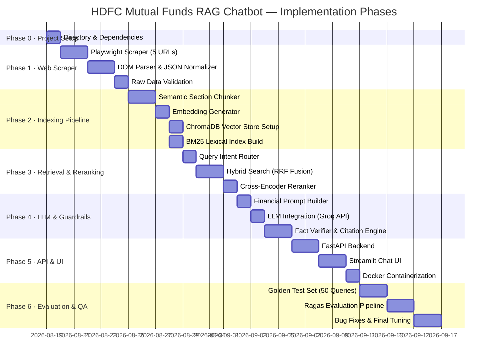

# Phase-Wise Implementation Plan: Financial RAG Chatbot for HDFC Mutual Funds

> **Based on:** [Architecture.md](./Architecture.md) | [problemstatement.md](./problemstatement.md)
> **Data Sources:** 5 HDFC Mutual Fund pages on Groww (Mid-Cap, Small-Cap, Multi-Cap, Large-Cap, Gold FoF)

---

## Implementation Phases Overview



---

## Phase 0 — Project Initialization

> **Objective:** Set up the project skeleton, virtual environment, and dependency configuration.

### 0.1 Directory Structure & Dependencies

- [ ] Create project directory structure:
  ```
  hdfc-rag-chatbot/
  ├── scraper/
  ├── indexer/
  ├── retriever/
  ├── generator/
  ├── api/
  ├── ui/
  ├── evaluation/
  ├── data/
  │   ├── raw/         # Scraped JSON per fund
  │   └── chunks/      # Chunked text files
  ├── docker/
  ├── tests/
  ├── requirements.txt
  └── .env
  ```
- [ ] Create Python virtual environment and activate it: `python -m venv venv`
- [ ] Create `requirements.txt` with core dependencies:

  | Library | Purpose |
  | :--- | :--- |
  | `playwright` | Headless browser scraping (Groww is Next.js, requires JS execution) |
  | `beautifulsoup4` | HTML DOM traversal for table extraction |
  | `pydantic` | JSON schema validation and data models |
- [ ] Install dependencies: `pip install -r requirements.txt`

- [ ] Create `.env` template with:
  ```
  GROQ_API_KEY=
  CHROMA_DB_PATH=./data/chroma
  BM25_INDEX_PATH=./data/bm25
  RAW_DATA_PATH=./data/raw
  ```

---

**Phase 0 Exit Criteria:**
- ✅ Directory structure established
- ✅ Virtual environment created and dependencies installed
- ✅ `.env` and `requirements.txt` correctly populated

---

## Phase 1 — Web Scraping & ETL Layer

> **Objective:** Scrape all 5 target Groww URLs and produce validated structured JSON files per fund.
> **Corresponds to:** Architecture Layer 1 — Data Ingestion & ETL

### 1.1 Playwright Web Scraper

- [ ] Install Playwright browsers: `playwright install chromium`
- [ ] Implement `scraper/groww_scraper.py`:
  - Accept a list of target fund URLs (hardcoded to the 5 HDFC fund URLs)
  - Launch headless Chromium, navigate to each URL, wait for `__NEXT_DATA__` JSON payload to be injected into the DOM
  - Extract `window.__NEXT_DATA__` JSON payload using `page.evaluate()`
  - Extract additional DOM elements (holdings table, sector allocation) using BeautifulSoup on the rendered HTML

**Target URLs (hardcoded, no dynamic discovery):**

| Constant | URL |
| :--- | :--- |
| `HDFC_MID_CAP_URL` | `https://groww.in/mutual-funds/hdfc-mid-cap-fund-direct-growth` |
| `HDFC_SMALL_CAP_URL` | `https://groww.in/mutual-funds/hdfc-small-cap-fund-direct-growth` |
| `HDFC_GOLD_FOF_URL` | `https://groww.in/mutual-funds/hdfc-gold-etf-fund-of-fund-direct-plan-growth` |
| `HDFC_MULTI_CAP_URL` | `https://groww.in/mutual-funds/hdfc-multi-cap-fund-direct-growth` |
| `HDFC_LARGE_CAP_URL` | `https://groww.in/mutual-funds/hdfc-large-cap-fund-direct-growth` |

---

### 1.2 DOM Parser & Schema Normalizer

- [ ] Implement `scraper/parser.py`:
  - Extract and normalize the following fields from each fund page:

  | Field | Source |
  | :--- | :--- |
  | `nav`, `nav_date` | `__NEXT_DATA__` JSON / header section |
  | `aum_cr` | Fund details DOM section |
  | `expense_ratio_pct` | Fund details DOM section |
  | `min_sip` | Fund details DOM section |
  | `rating_stars` | Rating badge |
  | `risk_label` | Pill tag |
  | `return_1d_pct`, `return_1y_pct`, `return_3y_pct`, `return_5y_pct` | Return stats section |
  | `top_holdings` | Holdings table (list of `{stock, weight_pct}`) |
  | `sector_allocation` | Sector chart data (list of `{sector, weight_pct}`) |
  | `exit_load_rule` | Scheme info section |
  | `benchmark_index` | Scheme info section |
  | `fund_manager` | Scheme info section |

- [ ] Save each fund's normalized data as:
  ```
  data/raw/hdfc_mid_cap.json
  data/raw/hdfc_small_cap.json
  data/raw/hdfc_gold_fof.json
  data/raw/hdfc_multi_cap.json
  data/raw/hdfc_large_cap.json
  ```

---

### 1.3 Data Validation

- [ ] Implement Pydantic models in `scraper/models.py` — `FundScheme`, `Holding`, `SectorAllocation`
- [ ] Validate all 5 raw JSON files against schema; raise errors on null critical fields (NAV, AUM, Expense Ratio)
- [ ] Write `tests/test_scraper.py` — Assert all 5 JSON files exist, have valid types, and non-null NAV

**Phase 1 Exit Criteria:**
- ✅ 5 valid JSON files in `data/raw/`
- ✅ All mandatory fields (NAV, AUM, Expense Ratio, Min SIP, Rating) are populated
- ✅ Pydantic schema validation passes with zero errors

---

## Phase 2 — Indexing & Dual Vector Pipeline

> **Objective:** Transform raw fund JSON into semantic chunks, generate embeddings, and build both the Vector Store (ChromaDB) and BM25 Lexical Index.
> **Corresponds to:** Architecture Layer 2 — Dual Index Pipeline

### 2.1 Semantic Section Chunker

- [ ] Implement `indexer/chunker.py`:
  - Reconstruct each fund's raw JSON into 5 semantic section Markdown strings:

  | Section | Content (Parsed Fields) |
  | :--- | :--- |
  | `scheme_overview` | `scheme_name`, `category`, `risk_label`, `rating_stars` |
  | `key_financial_indicators` | `nav`, `nav_date`, `aum_cr`, `expense_ratio_pct`, `min_sip` |
  | `historical_returns` | `return_1d_pct`, `return_1y_pct`, `return_3y_pct`, `return_5y_pct` |
  | `portfolio_allocation` | `top_holdings`, `sector_allocation` |
  | `scheme_rules` | `exit_load_rule`, `benchmark_index`, `fund_manager` |

- [ ] Enforce max 512 tokens per chunk with 64-token overlap for multi-section boundaries
- [ ] Attach per-chunk metadata dict:
  ```python
  {
    "chunk_id": "hdfc_mid_cap_kfi_001",
    "scheme_slug": "hdfc-mid-cap-fund-direct-growth",
    "scheme_name": "HDFC Mid Cap Fund Direct Growth",
    "fund_house": "HDFC Mutual Fund",
    "category": "Equity - Mid Cap",
    "section": "key_financial_indicators",
    "source_url": "https://groww.in/mutual-funds/hdfc-mid-cap-fund-direct-growth",
    "scraped_at": "<timestamp>"
  }
  ```
- [ ] Expected output: 25 chunks total (5 sections × 5 funds)

---

### 2.2 Embedding Generation & Vector Store

- [ ] Implement `indexer/embedder.py`:
  - Load `BAAI/bge-small-en-v1.5` using `sentence-transformers` to generate 384-dim vectors
  - *Design Note*: `bge-small-en-v1.5` is explicitly chosen over `bge-large` because our chunks are very short (usually <100 tokens), highly structured, and keyword-dense. BGE small provides lightning-fast latency with minimal accuracy loss for this specific data profile.
  - Batch all 25 chunk texts for fast local inference
- [ ] Implement `indexer/vector_store.py`:
  - Initialize `chromadb.PersistentClient(path="./data/chroma")`
  - Create collection `hdfc_mf_corpus` with cosine distance metric
  - Upsert all 25 embeddings with their text content and metadata dicts
- [ ] Write `tests/test_vector_store.py` — Query each fund name and assert at least 1 relevant chunk is returned in Top-5

---

### 2.3 BM25 Lexical Index

- [ ] Implement `indexer/bm25_index.py`:
  - Tokenize all 25 chunk texts using `nltk` word tokenizer
  - Build `BM25Okapi` index from `rank-bm25` library
  - Serialize and save index to `data/bm25/bm25_index.pkl` using `pickle`
  - Save corresponding chunk metadata list to `data/bm25/bm25_chunks.json`
- [ ] Write `tests/test_bm25.py` — Query `"HDFC Small Cap expense ratio"` and assert top-1 result contains the Small Cap chunk

**Phase 2 Exit Criteria:**
- ✅ 25 semantic chunks generated across 5 funds × 5 sections
- ✅ ChromaDB collection `hdfc_mf_corpus` populated and queryable
- ✅ BM25 index serialized and returns correct top-1 for exact financial queries
- ✅ All unit tests pass

---

## Phase 3 — Hybrid Retrieval & Reranking Engine

> **Objective:** Build the query routing system, hybrid RRF retrieval engine, and Cross-Encoder reranker that selects the Top-5 most relevant chunks per query.
> **Corresponds to:** Architecture Layer 3 — Hybrid Retrieval & Reranking

### 3.1 Query Intent Router

- [ ] Implement `retriever/router.py`:

  | Intent Class | Detection Rule | Retrieval Mode |
  | :--- | :--- | :--- |
  | `DIRECT_LOOKUP` | Contains keywords: NAV, AUM, expense ratio, SIP, rating | BM25-priority |
  | `COMPARATIVE` | Contains fund name pairs / "vs" / "compare" | Dense + BM25 balanced |
  | `PORTFOLIO_HOLDING` | Contains "holds", "invest in", "holding", stock name | Dense-priority |
  | `GUIDANCE` | General questions about exit load, lock-in, benchmark | Dense-priority |

---

### 3.2 Hybrid RRF Fusion Engine

- [ ] Implement `retriever/hybrid_search.py`:
  - Run Dense similarity search on ChromaDB: Top-10 chunks
  - Run BM25 keyword search on in-memory index: Top-10 chunks
  - Apply Intent-Weighted Reciprocal Rank Fusion:
    ```python
    def rrf_score(rank_dense: int, rank_sparse: int, weight_dense: float, weight_sparse: float, k: int = 60) -> float:
        dense_score = (weight_dense / (k + rank_dense)) if rank_dense > 0 else 0
        sparse_score = (weight_sparse / (k + rank_sparse)) if rank_sparse > 0 else 0
        return dense_score + sparse_score
    ```
    - `DIRECT_LOOKUP` intent: Sparse=0.8, Dense=0.2
    - `COMPARATIVE` intent: Sparse=0.5, Dense=0.5
    - `GUIDANCE`/`PORTFOLIO` intent: Sparse=0.2, Dense=0.8
  - Merge ranked lists; return Top-10 candidates to reranker

---

### 3.3 Cross-Encoder Reranker

- [ ] Implement `retriever/reranker.py`:
  - Load `BAAI/bge-reranker-base` via `sentence-transformers`
  - Score each of the Top-10 RRF candidates against the user query
  - Return Top-5 highest-scoring chunks with scores, text, and metadata
- [ ] Write `tests/test_retrieval.py`:
  - Test 4 sample queries (one per intent class)
  - Assert Top-5 chunks contain the correct fund's section
  - Assert no chunk from an irrelevant fund is ranked #1 for a direct lookup query

**Phase 3 Exit Criteria:**
- ✅ Query router correctly classifies all 4 intent types
- ✅ RRF fusion returns merged candidate list from both indexes
- ✅ Cross-Encoder selects correct Top-5 for all 4 test queries
- ✅ Unit tests pass with correct fund section in Top-1 result

---

## Phase 4 — LLM Generation & Financial Guardrails

> **Objective:** Build the prompt construction pipeline, integrate the LLM (Groq API), and add a numeric fact verifier + citation injector to prevent hallucinated financial figures.
> **Corresponds to:** Architecture Layer 4 — LLM + Guardrails

### 4.1 Input Guardrails (Prompt Guard)
- [ ] Implement `generator/guardrail.py`:
  - Run the user query through `qwen/qwen3.6-27b` via Groq API to act as a prompt injection classifier.
  - Implement Tenacity rate limits reflecting Qwen's limits: 30 RPM, 8K TPM.
  - If output classification indicates a jailbreak or injection (e.g. "unsafe"), block the request entirely and return a canned safety message.

---

### 4.1 Financial Prompt Builder

- [ ] Implement `generator/prompt_builder.py`:
  - Compose 4-block prompt:

    ```
    [SYSTEM]  Financial expert persona + anti-hallucination rules
    [RULES]   Numeric verbatim copy rule + "I don't know" fallback rule
    [CONTEXT] Top-5 chunks formatted as labeled fund data blocks
    [QUERY]   Original user question
    ```
  - For comparative queries, inject chunks from multiple funds and instruct LLM to produce a markdown table

---

### 4.2 LLM Integration

- [ ] Implement `generator/llm_engine.py`:
  - Use `groq.chat.completions.create(model="llama3-8b-8192", stream=True, temperature=0.0)`
  - Temperature set to `0.0` to maximize factual determinism
  - Stream tokens back via Server-Sent Events (SSE)

---

### 4.3 Fact Verifier & Citation Engine

- [ ] Implement `generator/verifier.py`:
  - Extract all numeric entities from the generated response (regex: currency, percentages, dates)
  - For each numeric, verify it appears verbatim in at least one of the Top-5 retrieved chunks
  - If any numeric fails verification: replace response with:
    > *"Verified data not available in the knowledge base for this figure."*
- [ ] Implement `generator/citation_injector.py`:
  - Append source URLs for every fund scheme referenced in the response
  - Append mandatory disclaimer at the end of every response:
    > *⚠️ This is not financial advice. Past performance is not indicative of future returns. Please consult a SEBI-registered financial advisor before investing.*

- [ ] Write `tests/test_generator.py`:
  - Assert response for *"What is the NAV of HDFC Mid Cap Fund?"* contains `235.87` (or latest scraped value)
  - Assert response ends with disclaimer text
  - Assert source URL for HDFC Mid Cap is present in citations

**Phase 4 Exit Criteria:**
- ✅ Prompt builder constructs valid 4-block prompt for all 4 query types
- ✅ LLM returns grounded response at `temperature=0.0`
- ✅ Numeric verifier catches and flags hallucinated values
- ✅ Citation injector appends correct Groww source URLs
- ✅ Disclaimer appended to 100% of responses

---

## Phase 5 — API Backend & Chat UI

> **Objective:** Expose the end-to-end RAG pipeline as a REST API and build an interactive investor-facing chat interface.
> **Corresponds to:** Architecture Layer 5 — API & User Interface

### 5.1 FastAPI Backend

- [ ] Implement `api/main.py` with the following endpoints:

  | Endpoint | Method | Description |
  | :--- | :--- | :--- |
  | `/api/v1/chat` | `POST` | Accepts `{query, history[]}`, runs full RAG pipeline, streams response via SSE |
  | `/api/v1/ingest` | `POST` | Re-runs scraper for all 5 Groww URLs and rebuilds ChromaDB + BM25 index |
  | `/api/v1/funds` | `GET` | Returns list of 5 supported HDFC funds + latest NAV from raw JSON store |
  | `/api/v1/compare` | `POST` | Structured comparison of 2 specified fund slugs, returns markdown table |
  | `/api/v1/health` | `GET` | Returns ChromaDB collection count, BM25 index size, and Groq API connectivity status |

- [ ] Add Pydantic request/response models for all endpoints
- [ ] Enable CORS for local Streamlit UI at `http://localhost:8501`

---

### 5.2 Streamlit Chat UI (PoC)

- [ ] Implement `ui/app.py` with:
  - Chat message history (user / assistant bubbles)
  - Pre-built quick-action prompt pills:
    - *"Compare HDFC Mid Cap vs Small Cap expense ratio"*
    - *"What is the NAV of HDFC Gold ETF FoF today?"*
    - *"Which HDFC fund has the highest 3-year returns?"*
    - *"Explain exit load rules for HDFC Large Cap Fund"*
  - Streamed token output (SSE consumer)
  - Citation links panel below each assistant response
  - Financial disclaimer banner at top of page

---

### 5.3 Docker Containerization

- [ ] Create `docker/Dockerfile.api` for FastAPI service
- [ ] Create `docker/Dockerfile.ui` for Streamlit UI
- [ ] Create `docker-compose.yml` with services:
  - `api` (FastAPI, port 8000)
  - `ui` (Streamlit, port 8501)
  - `chromadb` (Qdrant-compatible, port 8080)
  - `redis` (Response cache, port 6379, NAV TTL = 1 hour)
- [ ] Write startup `ingest` job that scrapes and builds indexes on first container launch

**Phase 5 Exit Criteria:**
- ✅ All 5 API endpoints return correct responses
- ✅ `/api/v1/chat` streams tokens end-to-end from query to citation
- ✅ Streamlit UI renders chat messages with citations and disclaimer
- ✅ `docker-compose up` launches full stack successfully

---

## Phase 6 — Evaluation, Testing & Quality Assurance

> **Objective:** Validate system accuracy using a structured golden test set and Ragas evaluation pipeline, then fix and tune until all benchmarks are met.
> **Corresponds to:** Architecture Section 6 — Non-Functional Requirements

### 6.1 Golden Test Set Construction (50 Queries)

- ✅ Create `evaluation/golden_test_set.json` with 50 queries and expected answers distributed as:

  | Query Type | # Queries | Example |
  | :--- | :--- | :--- |
  | Direct Lookup | 15 | *"What is the expense ratio of HDFC Small Cap?"* |
  | Comparative | 15 | *"Which fund has higher AUM — HDFC Mid Cap or Multi Cap?"* |
  | Portfolio/Holdings | 10 | *"What is the top holding in HDFC Large Cap Fund?"* |
  | Guidance | 10 | *"What is the exit load policy for HDFC Gold ETF FoF?"* |

---

### 6.2 Ragas Evaluation Pipeline

- ✅ Install `ragas` and configure evaluation dataset
- ✅ Implement `evaluation/run_evaluation.py`:
  - Feed all 50 golden queries through the full RAG pipeline
  - Collect `{query, answer, contexts, ground_truth}` for each
  - Compute the following Ragas metrics:

  | Metric | Target | Description |
  | :--- | :--- | :--- |
  | **Faithfulness** | > 95% | Answer claims supported by retrieved context |
  | **Answer Relevance** | > 90% | Answer directly addresses the query |
  | **Context Precision** | > 85% | Retrieved chunks are actually relevant |
  | **Numeric Accuracy** | 100% | All financial figures match the source JSON exactly |

- [ ] Save evaluation report to `evaluation/results/ragas_report.json`

---

### 6.3 Bug Fixes & Final Tuning

- [ ] Review all queries scoring below target thresholds
- [ ] Tune chunking strategy or prompt rules for failing query types
- [ ] Re-run Ragas evaluation until all 4 metrics meet their targets
- [ ] Write final `tests/test_integration.py` — end-to-end test of all 5 API endpoints

**Phase 6 Exit Criteria:**
- ✅ Faithfulness ≥ 95%
- ✅ Answer Relevance ≥ 90%
- ✅ Context Precision ≥ 85%
- ✅ Numeric Accuracy = 100% across all 50 golden test queries
- ✅ All integration tests pass

---

## Implementation Summary

| Phase | Focus | Key Output | Est. Duration |
| :--- | :--- | :--- | :--- |
| **Phase 1** | Environment & Web Scraper | 5 validated raw JSON files from Groww | 6 days |
| **Phase 2** | Indexing Pipeline | 25 semantic chunks + ChromaDB + BM25 index | 5 days |
| **Phase 3** | Hybrid Retrieval & Reranking | Query router + RRF fusion + Cross-Encoder Top-5 | 4 days |
| **Phase 4** | LLM & Financial Guardrails | Grounded streaming responses + fact verifier + citations | 4 days |
| **Phase 5** | API & Chat UI | FastAPI + Streamlit + Docker Compose stack | 5 days |
| **Phase 6** | Evaluation & QA | Ragas report + all metrics at target | 6 days |
| **Total** | | **Full working RAG Chatbot** | **~30 days** |
